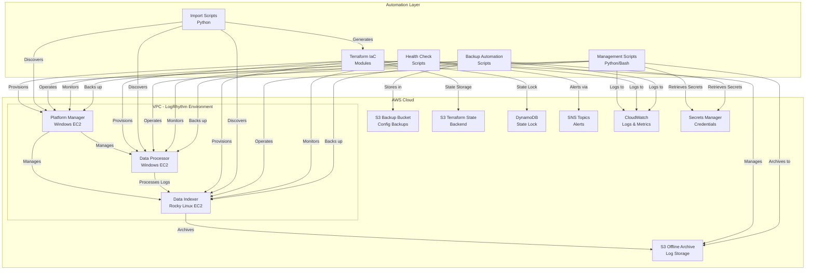
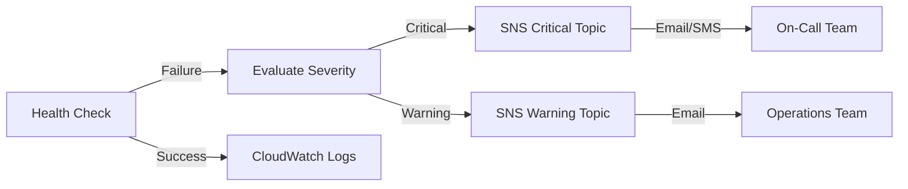
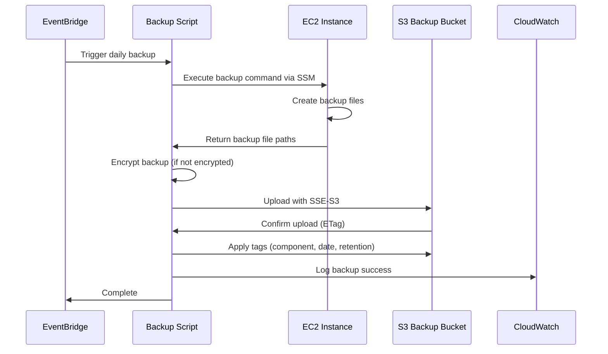

# Design Document

## Parent Documents

This document is a child of additional references:
- #[[file:requirements.md]]

## Overview

Technical approach for automating LogRhythm SIEM infrastructure on AWS through Infrastructure as Code (Terraform) and operational automation scripts. Transforms manually-managed AWS resources into a fully automated, version-controlled infrastructure supporting the three-tier LogRhythm deployment (Platform Manager, Data Processor, Data Indexer) with S3-based offline archival.

Phased approach: (1) import existing resources into Terraform state, (2) establish IaC management for all infrastructure, (3) implement operational automation scripts for maintenance and monitoring, and (4) create backup and disaster recovery automation.

## Architecture

### High-Level Architecture



### Component Architecture

The solution consists of four primary layers:

1. **Infrastructure Layer**: Existing AWS resources (EC2 instances, S3 buckets, security groups, IAM roles)
2. **IaC Layer**: Terraform modules that define and manage infrastructure
3. **Automation Layer**: Python and Bash scripts for operations, monitoring, and backup
4. **Observability Layer**: CloudWatch, SNS, and logging infrastructure

## Components and Interfaces

### 1. Terraform IaC Modules

#### Module Structure

```
terraform/
├── main.tf                 # Root module orchestration
├── variables.tf            # Input variables
├── outputs.tf              # Output values
├── backend.tf              # S3 backend configuration
├── versions.tf             # Provider versions
├── modules/
│   ├── ec2-logrhythm/      # EC2 instance module
│   │   ├── main.tf
│   │   ├── variables.tf
│   │   └── outputs.tf
│   ├── s3-archive/         # S3 bucket module
│   │   ├── main.tf
│   │   ├── variables.tf
│   │   └── outputs.tf
│   ├── security-groups/    # Security group module
│   │   ├── main.tf
│   │   ├── variables.tf
│   │   └── outputs.tf
│   └── iam/                # IAM roles and policies
│       ├── main.tf
│       ├── variables.tf
│       └── outputs.tf
└── environments/
    └── production/
        ├── terraform.tfvars
        └── backend.tfvars
```

#### Key Terraform Resources

**EC2 Instance Module** (`modules/ec2-logrhythm/`)
- Manages EC2 instances for Platform Manager, Data Processor, and Data Indexer
- Configures instance type, AMI, EBS volumes, and network interfaces
- Applies tags for resource identification and cost allocation
- Attaches IAM instance profiles for AWS service access

**S3 Archive Module** (`modules/s3-archive/`)
- Manages the offline archive S3 bucket
- Configures lifecycle policies for log retention and Glacier transition
- Enables versioning and server-side encryption
- Sets bucket policies for access control

**Security Group Module** (`modules/security-groups/`)
- Defines ingress and egress rules for each LogRhythm component
- Implements least-privilege network access
- Documents port requirements for LogRhythm inter-component communication

**IAM Module** (`modules/iam/`)
- Creates instance profiles for EC2 instances
- Defines policies for S3 access, CloudWatch logging, Secrets Manager access
- Implements least-privilege access patterns

#### Backend Configuration

```hcl
terraform {
  backend "s3" {
    bucket         = "[organization]-terraform-state"
    key            = "logrhythm/terraform.tfstate"
    region         = "us-east-1"
    dynamodb_table = "terraform-state-lock"
    encrypt        = true
  }
}
```

### 2. Import Scripts

#### Import Script Architecture

**Technology Stack**: Python 3.9+, Boto3 SDK

**Script Structure**:
```
scripts/import/
├── import_logrhythm_infra.py    # Main import orchestrator
├── resource_discovery.py         # AWS resource discovery
├── terraform_generator.py        # Terraform config generator
├── state_importer.py             # Terraform import executor
├── validation.py                 # Post-import validation
└── config/
    └── resource_mappings.yaml    # Resource type mappings
```

**Import Workflow**:
1. **Discovery Phase**: Use Boto3 to query AWS APIs and identify all LogRhythm-related resources
2. **Mapping Phase**: Map discovered resources to Terraform resource types
3. **Generation Phase**: Generate Terraform configuration files from discovered state
4. **Import Phase**: Execute `terraform import` commands for each resource
5. **Validation Phase**: Run `terraform plan` to verify zero-drift state

**Resource Discovery Logic**:
- Query EC2 instances by tags (e.g., `Application=LogRhythm`)
- Discover associated EBS volumes, network interfaces, security groups
- Identify IAM roles attached to instances
- Locate S3 buckets with LogRhythm-related naming patterns
- Map dependencies between resources

**Terraform Generation**:
- Generate HCL configuration files from AWS resource attributes
- Preserve existing resource configurations (instance types, storage, networking)
- Create variable definitions for environment-specific values
- Generate import commands for Terraform state

### 3. Management Scripts

#### Script Categories

**Archive Management** (`scripts/management/archive_logs.py`)
- Identifies inactive log files on Data Indexer based on age threshold
- Uploads logs to S3 Offline Archive with metadata tagging
- Verifies successful upload via S3 ETag validation
- Removes local files after confirmed S3 storage
- Logs all operations to CloudWatch

**Service Management** (`scripts/management/restart_services.sh`)
- Restarts LogRhythm services in correct sequence:
  1. Data Indexer (Rocky Linux)
  2. Data Processor (Windows)
  3. Platform Manager (Windows)
- Validates service status after each restart
- Implements wait periods for service initialization
- Logs restart operations with timestamps

**Metrics Collection** (`scripts/management/collect_metrics.py`)
- Connects to each EC2 instance via AWS Systems Manager Session Manager
- Collects system metrics: CPU, memory, disk usage, network throughput
- Publishes custom metrics to CloudWatch
- Runs on scheduled basis (every 5 minutes)

#### Management Script Interface

**Common Interface Pattern**:
```python
class ManagementScript:
    def __init__(self, config):
        self.ec2_client = boto3.client('ec2')
        self.s3_client = boto3.client('s3')
        self.ssm_client = boto3.client('ssm')
        self.cloudwatch = boto3.client('logs')
        
    def execute(self):
        """Main execution method - idempotent"""
        pass
        
    def log_action(self, action, status, details):
        """Log to CloudWatch Logs"""
        pass
        
    def handle_error(self, error):
        """Centralized error handling"""
        pass
```

### 4. Health Check Scripts

#### Health Check Architecture

**Technology Stack**: Python 3.9+, Boto3, requests

**Script Structure**:
```
scripts/health/
├── health_check_orchestrator.py  # Main health check runner
├── checks/
│   ├── platform_manager_check.py
│   ├── data_processor_check.py
│   ├── data_indexer_check.py
│   ├── s3_archive_check.py
│   └── connectivity_check.py
├── alerting.py                   # SNS notification handler
└── reporting.py                  # Report generation
```

**Health Check Types**:

1. **Service Status Checks**
   - Platform Manager: Query Windows service status via SSM
   - Data Processor: Verify service running and log processing active
   - Data Indexer: Check service status on Rocky Linux

2. **Resource Checks**
   - Disk space monitoring (alert at 80% threshold)
   - Memory utilization
   - CPU usage patterns

3. **Connectivity Checks**
   - Platform Manager → Data Processor communication
   - Platform Manager → Data Indexer communication
   - Data Processor → Data Indexer communication
   - All components → S3 Archive access

4. **S3 Archive Checks**
   - Bucket accessibility
   - IAM permissions validation
   - Lifecycle policy verification

**Alert Severity Levels**:
- **Critical**: Service down, disk >95%, connectivity failure
- **Warning**: Disk 80-95%, high CPU/memory, degraded performance
- **Info**: Successful health checks, routine status

**Notification Flow**:


### 5. Backup Automation

#### Backup Architecture

**Technology Stack**: Python 3.9+, Boto3, Windows PowerShell (for Windows backups)

**Script Structure**:
```
scripts/backup/
├── backup_orchestrator.py        # Main backup coordinator
├── backup_handlers/
│   ├── platform_manager_backup.py
│   ├── data_processor_backup.py
│   └── data_indexer_backup.py
├── s3_uploader.py                # S3 upload with encryption
├── lifecycle_manager.py          # S3 lifecycle policy management
└── verification.py               # Backup integrity validation
```

**Backup Strategy**:

1. **Platform Manager Backup**
   - LogRhythm SQL Server database backup
   - Configuration files from `C:\Program Files\LogRhythm\`
   - System registry settings related to LogRhythm
   - Backup method: SQL Server backup to local disk, then S3 upload

2. **Data Processor Backup**
   - Configuration files from `C:\Program Files\LogRhythm\`
   - Processing rules and filters
   - Custom parsers and policies

3. **Data Indexer Backup**
   - Configuration files from `/var/log/logrhythm/`
   - Index metadata
   - System configuration files

**Backup Workflow**:


**S3 Backup Bucket Structure**:
```
s3://[organization]-logrhythm-backups/
├── platform-manager/
│   ├── 2024-11-14/
│   │   ├── database-backup.bak
│   │   └── config-backup.zip
│   └── 2024-11-13/
├── data-processor/
│   └── 2024-11-14/
│       └── config-backup.zip
└── data-indexer/
    └── 2024-11-14/
        └── config-backup.tar.gz
```

**Lifecycle Policy**:
- Standard storage: 30 days
- Transition to Glacier: After 30 days
- Glacier retention: 365 days
- Deletion: After 395 days total

## Data Models

### Terraform State Data Model

**EC2 Instance Resource**:
```hcl
resource "aws_instance" "logrhythm_component" {
  ami                    = var.ami_id
  instance_type          = var.instance_type
  subnet_id              = var.subnet_id
  vpc_security_group_ids = var.security_group_ids
  iam_instance_profile   = var.instance_profile_name
  
  root_block_device {
    volume_type           = "gp3"
    volume_size           = var.root_volume_size
    encrypted             = true
    delete_on_termination = false
  }
  
  tags = {
    Name        = var.instance_name
    Environment = var.environment
    Application = "LogRhythm"
    Component   = var.component_type
    ManagedBy   = "Terraform"
  }
}
```

**S3 Bucket Resource**:
```hcl
resource "aws_s3_bucket" "logrhythm_archive" {
  bucket = var.bucket_name
  
  tags = {
    Name        = var.bucket_name
    Environment = var.environment
    Application = "LogRhythm"
    Purpose     = "OfflineArchive"
    ManagedBy   = "Terraform"
  }
}

resource "aws_s3_bucket_versioning" "archive_versioning" {
  bucket = aws_s3_bucket.logrhythm_archive.id
  
  versioning_configuration {
    status = "Enabled"
  }
}

resource "aws_s3_bucket_server_side_encryption_configuration" "archive_encryption" {
  bucket = aws_s3_bucket.logrhythm_archive.id
  
  rule {
    apply_server_side_encryption_by_default {
      sse_algorithm = "AES256"
    }
  }
}

resource "aws_s3_bucket_lifecycle_configuration" "archive_lifecycle" {
  bucket = aws_s3_bucket.logrhythm_archive.id
  
  rule {
    id     = "archive-transition"
    status = "Enabled"
    
    transition {
      days          = 90
      storage_class = "GLACIER"
    }
  }
}
```

### Script Configuration Data Model

**Configuration File Format** (YAML):
```yaml
# config/logrhythm_automation.yaml
aws:
  region: us-east-1
  profile: default

logrhythm:
  platform_manager:
    instance_id: INSTANCE_ID
    hostname: logrhythm-pm.internal
    backup_paths:
      - "C:\\Program Files\\LogRhythm\\LogRhythm Platform Manager"
      - "C:\\Program Files\\LogRhythm\\LogRhythm System Monitor"
    database:
      name: LogRhythmEMDB
      backup_path: "C:\\Backups\\LogRhythm"
  
  data_processor:
    instance_id: INSTANCE_ID
    hostname: logrhythm-dp.internal
    backup_paths:
      - "C:\\Program Files\\LogRhythm\\LogRhythm Data Processor"
  
  data_indexer:
    instance_id: INSTANCE_ID
    hostname: logrhythm-di.internal
    backup_paths:
      - "/var/log/logrhythm"
      - "/etc/logrhythm"
    archive:
      local_path: "/mnt/logrhythm/archive"
      age_threshold_days: 90

s3:
  archive_bucket: [organization]-logrhythm-archive
  backup_bucket: [organization]-logrhythm-backups
  
cloudwatch:
  log_group: /aws/logrhythm/automation
  retention_days: 30

sns:
  critical_topic_arn: arn:aws:sns:us-east-1:ACCOUNT_ID:logrhythm-critical
  warning_topic_arn: arn:aws:sns:us-east-1:ACCOUNT_ID:logrhythm-warning

health_checks:
  disk_warning_threshold: 80
  disk_critical_threshold: 95
  check_interval_minutes: 5
```

### Health Check Report Data Model

**JSON Report Format**:
```json
{
  "timestamp": "2024-11-14T10:30:00Z",
  "overall_status": "healthy",
  "components": [
    {
      "name": "platform_manager",
      "instance_id": "INSTANCE_ID",
      "status": "healthy",
      "checks": [
        {
          "check_type": "service_status",
          "status": "pass",
          "message": "LogRhythm Platform Manager service is running"
        },
        {
          "check_type": "disk_space",
          "status": "pass",
          "value": 65,
          "unit": "percent",
          "message": "Disk usage at 65%"
        }
      ]
    },
    {
      "name": "data_processor",
      "instance_id": "INSTANCE_ID",
      "status": "warning",
      "checks": [
        {
          "check_type": "disk_space",
          "status": "warning",
          "value": 82,
          "unit": "percent",
          "message": "Disk usage at 82% - exceeds warning threshold"
        }
      ]
    }
  ],
  "alerts_sent": [
    {
      "severity": "warning",
      "component": "data_processor",
      "message": "Disk usage exceeds 80% threshold",
      "sns_message_id": "abc123-def456"
    }
  ]
}
```

## Error Handling

### Terraform Error Handling

**Import Script Error Handling**:
- **Resource Not Found**: Log warning, continue with other resources
- **Permission Denied**: Fail fast with clear IAM permission requirements
- **State Conflict**: Detect existing state, prompt for resolution strategy
- **Import Failure**: Retry with exponential backoff, log error details

**Terraform Apply Error Handling**:
- **Plan Validation**: Always run `terraform plan` before apply
- **Resource Conflicts**: Detect and report conflicts with existing resources
- **Partial Apply Failure**: Terraform handles state consistency automatically
- **State Lock Timeout**: Implement retry logic with DynamoDB lock table

### Script Error Handling

**Common Error Patterns**:

1. **AWS API Errors**
   ```python
   try:
       response = ec2_client.describe_instances(InstanceIds=[instance_id])
   except ClientError as e:
       if e.response['Error']['Code'] == 'InvalidInstanceID.NotFound':
           logger.error(f"Instance {instance_id} not found")
           # Handle gracefully - may have been terminated
       elif e.response['Error']['Code'] == 'UnauthorizedOperation':
           logger.critical("Insufficient IAM permissions")
           raise  # Fail fast on permission issues
       else:
           logger.error(f"Unexpected AWS error: {e}")
           # Retry with exponential backoff
   ```

2. **S3 Upload Failures**
   - Implement multipart upload for large files
   - Retry failed uploads up to 3 times
   - Verify upload integrity using ETag comparison
   - Log failed uploads for manual intervention

3. **SSM Command Execution Failures**
   - Timeout handling (default: 5 minutes)
   - Command failure detection via exit codes
   - Capture stdout/stderr for debugging
   - Retry transient failures

4. **Health Check Failures**
   - Distinguish between component failure and check failure
   - Implement circuit breaker pattern for repeated failures
   - Escalate persistent failures to critical alerts
   - Log all check results regardless of outcome

### Logging Strategy

**CloudWatch Log Groups**:
- `/aws/logrhythm/import` - Import script logs
- `/aws/logrhythm/management` - Management script logs
- `/aws/logrhythm/health` - Health check logs
- `/aws/logrhythm/backup` - Backup operation logs

**Log Format** (JSON structured logging):
```json
{
  "timestamp": "2024-11-14T10:30:00Z",
  "level": "INFO",
  "script": "archive_logs.py",
  "action": "upload_to_s3",
  "instance_id": "INSTANCE_ID",
  "component": "data_indexer",
  "details": {
    "file": "/mnt/logrhythm/archive/logs-2024-08-14.tar.gz",
    "size_bytes": 1073741824,
    "s3_key": "data-indexer/2024-08-14/logs-2024-08-14.tar.gz",
    "duration_seconds": 45.2
  },
  "status": "success"
}
```

## Testing Strategy

### Infrastructure Testing

**Terraform Testing Approach**:

1. **Validation Testing**
   - `terraform validate` - Syntax and configuration validation
   - `terraform fmt -check` - Code formatting standards
   - `tflint` - Linting for best practices and errors

2. **Plan Testing**
   - Generate plans in non-production environment
   - Review plans for unexpected changes
   - Validate resource dependencies

3. **Integration Testing**
   - Deploy to test environment
   - Verify resource creation and configuration
   - Test resource dependencies and connectivity
   - Validate IAM permissions

4. **Import Testing**
   - Test import script against non-production resources
   - Verify generated Terraform matches actual state
   - Validate zero-drift after import

### Script Testing

**Unit Testing**:
- Test individual functions with mocked AWS clients (using `moto` library)
- Validate error handling paths
- Test configuration parsing and validation
- Coverage target: 80%

**Integration Testing**:
- Test scripts against test EC2 instances
- Validate S3 operations with test buckets
- Test SNS notifications with test topics
- Verify CloudWatch logging

**End-to-End Testing**:
- Execute full backup workflow in test environment
- Run health checks against test infrastructure
- Test disaster recovery procedures
- Validate archive and restore operations

**Test Environment**:
- Separate AWS account or isolated VPC
- Smaller instance types to reduce costs
- Automated teardown after testing
- Test data generation for realistic scenarios

### Validation Criteria

**Import Validation**:
- `terraform plan` shows zero changes after import
- All resources successfully imported into state
- Generated Terraform configuration is syntactically valid
- Resource dependencies correctly represented

**Backup Validation**:
- Backup files successfully uploaded to S3
- File integrity verified (checksums match)
- Backup metadata correctly tagged
- Lifecycle policies applied correctly
- Test restore from backup successful

**Health Check Validation**:
- All components report correct status
- Alerts triggered for simulated failures
- SNS notifications delivered successfully
- Reports generated in correct format

**Management Script Validation**:
- Operations are idempotent (safe to re-run)
- All actions logged to CloudWatch
- Error conditions handled gracefully
- Services restart in correct sequence

## Implementation Phases

### Phase 1: Infrastructure Import
- Develop and test import scripts
- Import existing resources into Terraform state
- Validate zero-drift state
- Document current infrastructure configuration

### Phase 2: IaC Establishment
- Refactor imported configuration into modules
- Implement backend state management
- Establish CI/CD pipeline for Terraform changes
- Document Terraform usage and workflows

### Phase 3: Operational Automation
- Develop management scripts (archive, service management, metrics)
- Implement health check scripts
- Configure CloudWatch logging and SNS alerting
- Test automation in non-production environment

### Phase 4: Backup and DR
- Implement backup automation scripts
- Configure S3 lifecycle policies
- Test backup and restore procedures
- Document disaster recovery runbooks

### Phase 5: Production Deployment
- Deploy automation to production environment
- Schedule automated tasks (EventBridge/cron)
- Monitor automation execution
- Iterate based on operational feedback

## Security Considerations

### IAM Permissions

**Terraform Execution Role**:
- EC2: Full management permissions
- S3: Full management for LogRhythm buckets
- IAM: Role and policy management (limited scope)
- DynamoDB: State lock table access

**EC2 Instance Profiles**:
- S3: Read/write to archive and backup buckets
- CloudWatch: PutMetricData, CreateLogStream, PutLogEvents
- Secrets Manager: GetSecretValue (for credentials)
- SSM: Managed instance permissions

**Script Execution Role**:
- EC2: Describe instances, start/stop instances
- S3: Read/write to specific buckets
- SSM: SendCommand, GetCommandInvocation
- SNS: Publish to alert topics
- CloudWatch: Logs and metrics access

### Secrets Management

- Store LogRhythm credentials in AWS Secrets Manager
- Rotate credentials regularly (90-day cycle)
- Use IAM roles instead of access keys where possible
- Never commit credentials to version control

### Network Security

- Restrict security group rules to minimum required ports
- Use private subnets for LogRhythm components where possible
- Implement VPC endpoints for AWS service access
- Enable VPC Flow Logs for network monitoring

## Operational Considerations

### Monitoring and Alerting

**CloudWatch Dashboards**:
- EC2 instance metrics (CPU, memory, disk, network)
- Script execution status and duration
- Backup success/failure rates
- Health check status over time

**SNS Alert Topics**:
- Critical: Service failures, disk >95%, backup failures
- Warning: Disk 80-95%, performance degradation
- Info: Successful operations, routine status

### Maintenance Windows

- Schedule maintenance scripts during low-activity periods
- Coordinate service restarts to minimize downtime
- Implement graceful degradation for component failures
- Document maintenance procedures in runbooks

### Cost Optimization

- Use appropriate EC2 instance types (Reserved Instances for production)
- Implement S3 lifecycle policies to transition to cheaper storage
- Clean up old backups based on retention policies
- Monitor and optimize CloudWatch log retention

### Disaster Recovery

**Recovery Time Objective (RTO)**: 4 hours
**Recovery Point Objective (RPO)**: 24 hours (daily backups)

**DR Procedures**:
1. Provision new EC2 instances using Terraform
2. Restore configurations from S3 backups
3. Restore LogRhythm databases from backups
4. Validate component connectivity and functionality
5. Resume log processing operations

## Documentation Requirements

### Terraform Documentation
- README with module usage examples
- Variable descriptions and default values
- Output descriptions
- Architecture diagrams
- Change management procedures

### Script Documentation
- Inline code comments for complex logic
- README for each script category
- Configuration file examples
- Troubleshooting guides
- API documentation for reusable functions

### Operational Runbooks
- Import procedure step-by-step
- Infrastructure change workflow
- Backup and restore procedures
- Disaster recovery procedures
- Troubleshooting common issues
- Escalation procedures

## Dependencies and Prerequisites

### Required Tools
- Terraform >= 1.5.0
- Python >= 3.9
- Boto3 >= 1.28.0
- AWS CLI >= 2.0

### AWS Services
- EC2 (existing instances)
- S3 (state, backups, archives)
- DynamoDB (state locking)
- IAM (roles and policies)
- CloudWatch (logs and metrics)
- SNS (alerting)
- Secrets Manager (credentials)
- Systems Manager (remote execution)

### Access Requirements
- AWS account with appropriate permissions
- Access to existing LogRhythm EC2 instances
- Network access to LogRhythm components
- Git repository for version control

## Future Enhancements

- Implement automated scaling for Data Processor/Indexer
- Add automated log source configuration management
- Integrate with LogRhythm API for alarm management
- Implement automated compliance reporting
- Add cost analysis and optimization recommendations
- Implement blue/green deployment for updates
- Add automated performance tuning
